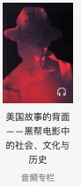

# 星球大战css3特效开发
- 能力增长点
    学习的目的在于不断设计能力增长点
    1.heckthon  黑客精神
    2.html/css/js 离开API
        -写html结构
            emmet 快速完成 热门专栏写法变了 作业
    3.markdown 语法格式
    [百度](http://www.baidu.com) 超链接的文字与链接n
    
    4.css基础
- 学习愿景
    极大的学习愿景
    去名企做高级玩意，代码世界的导演，html/css/js
    1.图片——演员
      背景图片  background repeat
      star 图片
      wars 图片
    2.布局
       定位到相应的地方
       css
       css 动画
        - 居中的做法
            1.先绝对定位，以中心点作为左上角
            2.向左移自身高度的一半  transform
            3.向上移自身高度的一半 

    3.结构及体验
       跟电影一模一样的效果

-开发素养
    1.工具思维
    2.落伍的操作
        -emmet
        快，使用css选择器，达到快速输入html的能力

        - ctrl+/  代码注释
        - >选择子元素
        - +兄弟节点
        - div 
        - [] 属性选择器
        - 文件访问方式
            document
          网络访问
            本地访问：127.0.0.1
            外网 买域名（阿里云领取免费服务器）
            
    

